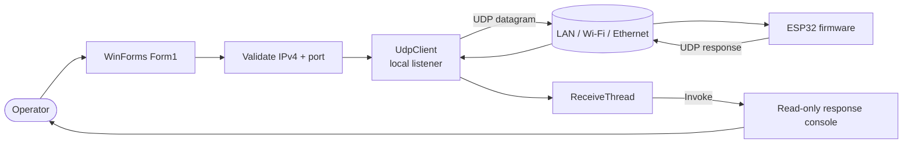
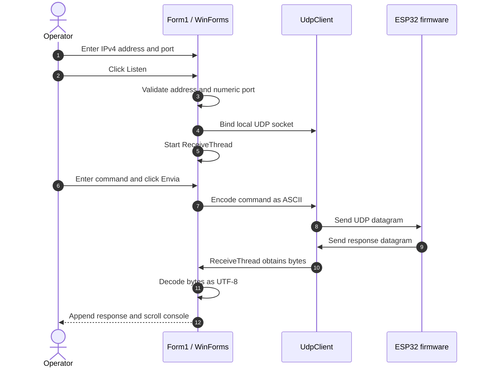

<div align="center">

# ESP32 Comm

### Windows desktop client for bidirectional UDP communication with ESP32 devices

A lightweight WinForms diagnostic console for sending commands to an ESP32 over IPv4/UDP and displaying device responses in real time.

[](https://www.microsoft.com/windows)
[](https://learn.microsoft.com/dotnet/csharp/)
[](https://learn.microsoft.com/dotnet/desktop/winforms/)
[](https://dotnet.microsoft.com/download/dotnet-framework)
[](https://datatracker.ietf.org/doc/html/rfc768)

</div>

---

## Contents

- [Overview](#overview)
- [Capabilities](#capabilities)
- [Architecture](#architecture)
- [Network schematic](#network-schematic)
- [Data flow](#data-flow)
- [Communication contract](#communication-contract)
- [Requirements](#requirements)
- [Build and run](#build-and-run)
- [Using the application](#using-the-application)
- [ESP32 firmware integration](#esp32-firmware-integration)
- [Project structure](#project-structure)
- [Limitations and security](#limitations-and-security)
- [Roadmap](#roadmap)
- [Contributing](#contributing)

## Overview

**ESP32 Comm** is a bench-side tool for developing, testing, and diagnosing embedded firmware. It provides a simple operator workflow:

1. enter the ESP32 IPv4 address and UDP port;
2. open a local UDP listener;
3. type and transmit an ASCII command; and
4. inspect UTF-8 responses in a scrollable diagnostic console.

The repository contains the **Windows client only**. The ESP32 firmware is external and must implement the command and response behavior required by your project.

> **Naming note:** the solution and C# namespace are currently named `CommEspe32`, while the repository and product documentation use `ESP32 Comm`.

## Capabilities

- IPv4 address and numeric-port input controls.
- Bidirectional UDP communication over Wi-Fi or Ethernet.
- ASCII command transmission to a configured endpoint.
- Dedicated receive thread so the WinForms UI remains responsive.
- Safe cross-thread UI updates via `Control.Invoke`.
- UTF-8 response decoding and auto-scrolling output console.
- Listener state management that locks endpoint fields while active.
- Simple integration path for custom diagnostic commands.

## Architecture



### Component responsibilities

| Component | Responsibility |
|---|---|
| `Program.cs` | Starts the WinForms application. |
| `Form1.cs` | Validates inputs, opens/closes the socket, sends commands, receives responses, and updates the UI. |
| `Form1.Designer.cs` | Defines the generated WinForms controls and layout. |
| `UdpClient` | Provides the UDP socket used for local reception and device transmission. |
| `ReceiveThread` | Blocks on `udp.Receive` without blocking the UI thread. |
| `Properties/Resources.resx` | Stores the listener-state button images. |
| ESP32 firmware | External component that parses commands and sends responses. |

## Network schematic

```text
                              LOCAL NETWORK

  ┌──────────────────────────────┐                    ┌────────────────────────────┐
  │ Windows workstation           │                    │ ESP32 device                │
  │                              │                    │                            │
  │ ESP32 Comm / WinForms        │                    │ User firmware              │
  │ UdpClient listens :5000      │                    │ UDP server :5000           │
  │                              │                    │ IP: 192.168.0.100          │
  └───────────────┬──────────────┘                    └─────────────┬──────────────┘
                  │                                                 │
                  └────────────── Wi-Fi / Ethernet ──────────────────┘

                 command: PC ───────────────────────────────▶ ESP32
                response: PC ◀─────────────────────────────── ESP32
```

### Endpoint model

| Role | Example | Description |
|---|---|---|
| Windows listener | `0.0.0.0:5000` | Local socket opened by the application to receive datagrams. |
| ESP32 destination | `192.168.0.100:5000` | IP and port entered in the application. |
| Transport | UDP over IPv4 | Connectionless transport with no delivery or ordering guarantee. |

The current implementation uses the same configured port for the local listener and the ESP32 destination. Configure the Windows firewall to allow inbound UDP traffic on that port.

## Data flow



### Listener state machine

```text
                 valid endpoint + Listen
  ┌──────────┐ ───────────────────────────▶ ┌─────────────────────┐
  │ Stopped  │                               │ Listening           │
  │ editable │ ◀─────────────────────────── │ socket + thread     │
  └──────────┘       Listen / close         │ endpoint locked     │
                                            └─────────────────────┘
```

## Communication contract

The client sends the contents of the command textbox as one ASCII UDP datagram. It accepts any response payload from the ESP32 and displays it as UTF-8 text followed by a new line.

```text
Outbound: ASCII bytes | one UDP datagram | command text
Inbound:  UTF-8 bytes  | one UDP datagram | displayed in response console
```

The client does not currently add framing, message IDs, checksums, authentication, retries, or a fixed command catalog. Those behaviors belong in the firmware/application protocol if needed.

### Example command set

These are suggested firmware commands, not commands enforced by the client:

| Command | Example purpose |
|---|---|
| `CPU` | Report chip model, revision, cores, and frequency. |
| `RAM` | Report free heap and memory statistics. |
| `NET_INFO` | Report IP, gateway, mask, RSSI, and SSID. |
| `TEMP` | Return a temperature reading when supported. |
| `UPTIME` | Return device uptime. |
| `MAC` | Return the network interface MAC address. |
| `LED_ON` / `LED_OFF` | Control a digital output. |
| `RESET_WIFI` | Reset network configuration. |

Example exchange:

```text
TX → CPU
RX ← Model: ESP32-D0WD-V3
     Revision: 301
     Cores: 2
     CPU: 240 MHz
     Free RAM: 230136 bytes
```

## Requirements

### Runtime

- Windows with .NET Framework 4.5 support.
- IP connectivity between the workstation and ESP32.
- Known ESP32 IPv4 address and UDP port.
- Windows Firewall rule allowing the selected UDP port.

### Development

- Visual Studio 2019 or newer.
- .NET Framework 4.5 targeting pack.
- Support for legacy MSBuild/.NET Framework WinForms projects.

## Build and run

```bash
git clone https://github.com/paulocfmarques-collab/esp32-Comm.git
cd esp32-Comm
```

Open `CommEspe32/CommEspe32.sln` in Visual Studio, select `Debug` or `Release` and `Any CPU`, then choose **Build → Rebuild Solution**. Start with **F5** or **Debug → Start Without Debugging**.

Build output is normally written to:

```text
CommEspe32/CommEspe32/bin/Debug/
CommEspe32/CommEspe32/bin/Release/
```

## Using the application

1. **Prepare the ESP32.** Connect it to the network, start its UDP listener, and make it reply to the sender's IP and source port.
2. **Configure the endpoint.** For example:
   ```text
   IP:    192.168.0.100
   Porta: 5000
   ```
3. **Start listening.** Click **Listen**. The endpoint fields become locked and command controls are enabled.
4. **Send a command.** Enter a command and click **Envia**. Responses appear in **Resposta**.
5. **Stop communication.** Click **Listen** again or close the window. The socket is closed when the form exits.

## ESP32 firmware integration

The firmware should reply to the source endpoint of each received packet. A conceptual Arduino/ESP32 `WiFiUDP` loop looks like this:

```cpp
int packetSize = udp.parsePacket();

if (packetSize > 0) {
    char buffer[256];
    int length = udp.read(buffer, sizeof(buffer) - 1);

    if (length > 0) {
        buffer[length] = '\0';

        // Parse the command and build a response here.
        udp.beginPacket(udp.remoteIP(), udp.remotePort());
        udp.print("OK");
        udp.endPacket();
    }
}
```

For production use, define a maximum payload size, normalize commands, return explicit errors, identify the device, and document encoding, terminators, timeout behavior, and protocol versioning.

## Project structure

```text
esp32-Comm/
├── README.md
└── CommEspe32/
    ├── CommEspe32.sln
    └── CommEspe32/
        ├── CommEspe32.csproj
        ├── App.config
        ├── Program.cs
        ├── Form1.cs
        ├── Form1.Designer.cs
        ├── Form1.resx
        ├── Check.png
        ├── X.png
        └── Properties/
            ├── AssemblyInfo.cs
            ├── Resources.resx
            ├── Resources.Designer.cs
            ├── Settings.settings
            └── Settings.Designer.cs
```

## Limitations and security

- **UDP is unreliable.** Delivery, ordering, and uniqueness are not guaranteed. Add ACKs, timeouts, and retries for critical commands.
- **There is no authentication or encryption.** Use only on trusted networks unless the protocol is extended with appropriate security controls.
- **Commands are not semantically validated by the client.** Validate and authorize commands in firmware.
- **The receiver uses a dedicated thread.** Future maintenance should prefer cooperative cancellation and deterministic socket disposal over forceful thread termination.
- **Payload and protocol limits are not enforced.** Define maximum sizes and structured error responses before production deployment.
- **Port conflicts are possible.** If binding fails, check firewall rules and other processes using the selected port.

## Roadmap

- [ ] Command history and favorites.
- [ ] TXT/CSV log export.
- [ ] Persisted IP and port settings.
- [ ] Automatic ESP32 discovery.
- [ ] Multi-device support.
- [ ] Configurable timeout, ACK, and retry policy.
- [ ] Connection status and latency metrics.
- [ ] Versioned JSON response protocol.
- [ ] Dark theme and accessibility improvements.
- [ ] TCP, MQTT, or BLE transports.

## Contributing

1. Fork the repository.
2. Create a focused feature branch.
3. Document the expected behavior and validation performed.
4. Keep diagrams and protocol documentation synchronized with code changes.
5. Open a Pull Request with sufficient technical context for review.

## License and project status

No license file is currently included in the repository. Add an explicit open-source license before redistributing the project or incorporating it into a commercial product.

## Author

**Paulo Cesar Furlanetto Marques**  
Interests: ESP32, Raspberry Pi, C#, PostgreSQL, embedded systems, networking, and IoT.

---

<div align="center">

If this project helped you, consider leaving a ⭐ on the repository.

</div>
