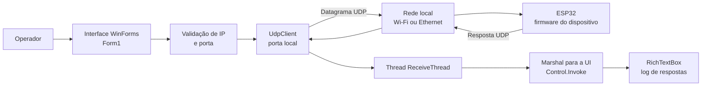
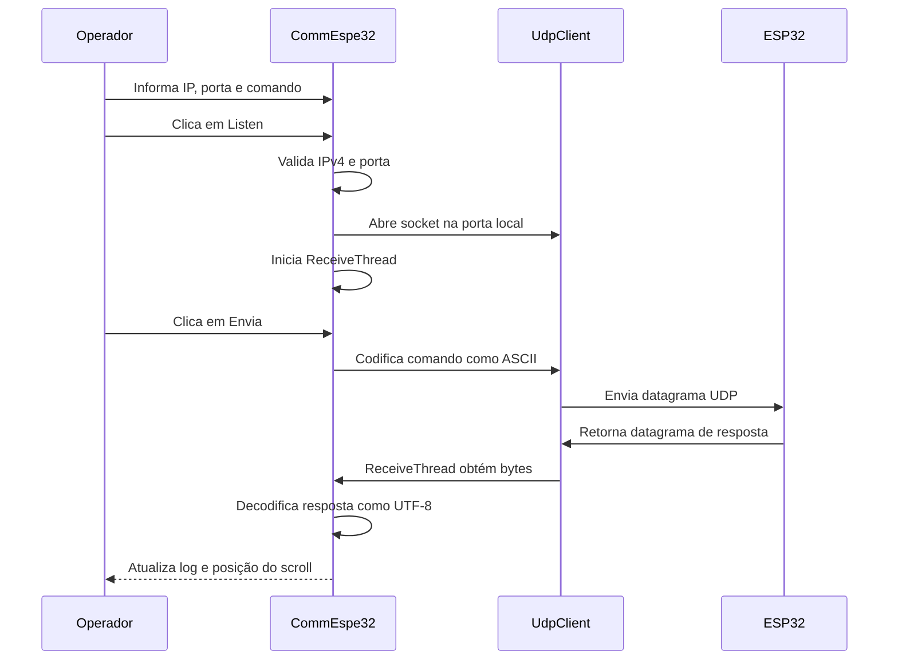

<div align="center">

# CommEspe32

### Cliente desktop Windows para diagnóstico e comunicação UDP com ESP32

Aplicação WinForms em C# para enviar comandos, receber respostas e acompanhar mensagens de dispositivos ESP32 em tempo real pela rede local.

[](https://www.microsoft.com/windows)
[](https://learn.microsoft.com/dotnet/csharp/)
[](https://learn.microsoft.com/dotnet/desktop/winforms/)
[](https://datatracker.ietf.org/doc/html/rfc768)
[](https://dotnet.microsoft.com/download/dotnet-framework)

</div>

---

## Sumário

- [Visão geral](#visão-geral)
- [Principais recursos](#principais-recursos)
- [Arquitetura](#arquitetura)
- [Esquemático de conexão](#esquemático-de-conexão)
- [Fluxo de dados](#fluxo-de-dados)
- [Protocolo de comunicação](#protocolo-de-comunicação)
- [Requisitos](#requisitos)
- [Compilação e execução](#compilação-e-execução)
- [Uso](#uso)
- [Firmware do ESP32](#firmware-do-esp32)
- [Estrutura do projeto](#estrutura-do-projeto)
- [Limitações e boas práticas](#limitações-e-boas-práticas)
- [Roadmap](#roadmap)
- [Contribuição](#contribuição)
- [Licença](#licença)

## Visão geral

O **CommEspe32** é uma ferramenta de bancada para desenvolvimento, teste e diagnóstico de firmware embarcado. O operador informa o endereço IPv4 e a porta UDP do ESP32, inicia o listener local e envia comandos de texto pela interface gráfica.

A aplicação:

1. abre um `UdpClient` na porta informada;
2. envia o comando para o endpoint configurado;
3. mantém uma thread dedicada aguardando datagramas de resposta;
4. converte as respostas recebidas como UTF-8; e
5. atualiza o console visual com rolagem automática.

> **Importante:** este repositório contém o cliente Windows. O firmware do ESP32 é externo e deve implementar o protocolo de comandos/respostas esperado pela sua aplicação.

## Principais recursos

- Configuração de IP e porta do dispositivo.
- Validação do endereço IPv4 e filtragem de caracteres no campo de porta.
- Comunicação UDP bidirecional em rede local.
- Envio de comandos ASCII personalizados.
- Recepção assíncrona por thread dedicada.
- Atualização segura dos controles WinForms usando `Invoke`.
- Console de respostas com limpeza ao iniciar e auto-scroll.
- Bloqueio dos campos de configuração enquanto a escuta está ativa.
- Compatibilidade com ESP32 conectado por Wi-Fi ou Ethernet, desde que acessível pela rede.

## Arquitetura



### Componentes principais

| Componente | Responsabilidade |
|---|---|
| `Program.cs` | Inicializa o runtime visual e abre `Form1`. |
| `Form1.cs` | Controla estado da comunicação, valida entradas, envia datagramas e recebe respostas. |
| `Form1.Designer.cs` | Código gerado pelo designer dos controles WinForms. |
| `UdpClient` | Socket UDP usado para escuta e transmissão. |
| `ReceiveThread` | Aguarda respostas sem bloquear a thread da interface. |
| `Properties/Resources.resx` | Ícones e recursos visuais dos botões. |
| ESP32 firmware | Implementação externa que interpreta comandos e produz respostas. |

## Esquemático de conexão

O ESP32 e o computador devem estar na mesma rede, ou em redes roteadas que permitam tráfego UDP entre os endpoints. Neste exemplo, o computador escuta na porta `5000` e envia para o ESP32 em `192.168.0.100:5000`.

```text
                           REDE LOCAL
┌──────────────────────────────┐       UDP        ┌──────────────────────────────┐
│ Computador Windows           │  ─────────────▶  │ ESP32                        │
│                              │  comando         │                              │
│ CommEspe32 / WinForms       │  ◀─────────────  │ Firmware UDP                 │
│ UdpClient escuta :5000      │  resposta        │ IP: 192.168.0.100            │
└──────────────┬───────────────┘                  └──────────────┬───────────────┘
               │                                                 │
               └────────────── Wi-Fi / Ethernet ─────────────────┘
```

### Endpoints

| Papel | Endereço de exemplo | Descrição |
|---|---|---|
| Cliente Windows | `0.0.0.0:5000` | Socket local aberto pelo aplicativo para receber respostas. |
| Destino ESP32 | `192.168.0.100:5000` | IP e porta informados na interface. |
| Transporte | UDP/IPv4 | Sem conexão persistente e sem garantia de entrega ou ordem. |

> A porta local e a porta de destino são configuradas com o mesmo valor pela implementação atual. O firewall do Windows deve permitir tráfego UDP nessa porta.

## Fluxo de dados



### Ciclo de vida do listener

```text
[Parado]
   │  Listen + entradas válidas
   ▼
[Socket aberto / thread iniciada]
   │  Envia comandos e recebe respostas
   ▼
[Ativo]
   │  Listen novamente ou fechamento da janela
   ▼
[Socket encerrado / controles liberados]
```

## Protocolo de comunicação

O protocolo é intencionalmente simples: um comando é enviado como um datagrama UDP contendo texto; o firmware responde com outro datagrama de texto. O cliente não impõe um catálogo fixo de comandos.

```text
Comando:  ASCII, sem envelope obrigatório
Resposta: UTF-8, exibida como uma linha no log
```

### Exemplos de comandos

Os comandos abaixo são sugestões de contrato para o firmware, não uma lista implementada pelo cliente:

| Comando | Exemplo de finalidade |
|---|---|
| `CPU` | Modelo, revisão, núcleos e frequência do processador. |
| `RAM` | Heap livre, menor heap e maior bloco livre. |
| `NET_INFO` | IP, gateway, máscara, RSSI e SSID. |
| `TEMP` | Leitura de temperatura, se suportada pelo firmware. |
| `UPTIME` | Tempo de funcionamento do dispositivo. |
| `MAC` | Endereço MAC da interface de rede. |
| `LED_ON` / `LED_OFF` | Controle de uma saída digital. |
| `RESET_WIFI` | Reinicialização da configuração de rede. |

### Exemplo de troca

```text
TX → CPU
RX ← Modelo: ESP32-D0WD-V3
     Revisao: 301
     Nucleos: 2
     CPU: 240 MHz
     RAM livre: 230136 bytes
```

## Requisitos

### Execução

- Windows com suporte ao **.NET Framework 4.5**.
- Conectividade IP entre o computador e o ESP32.
- Endereço IPv4 e porta UDP conhecidos.
- Regra de firewall permitindo a porta UDP utilizada.

### Desenvolvimento

- Visual Studio 2019 ou superior com suporte a projetos .NET Framework/WinForms.
- SDK/targeting pack do **.NET Framework 4.5**.
- Permissão para restaurar/compilar projetos legados do MSBuild, quando necessário.

## Compilação e execução

Clone o repositório oficial:

```bash
git clone https://github.com/paulocfmarques-collab/esp32-Comm.git
cd esp32-Comm
```

Abra a solução no Visual Studio:

```text
CommEspe32/CommEspe32.sln
```

Em seguida:

1. selecione `Debug` ou `Release`;
2. selecione `Any CPU`;
3. execute **Build → Rebuild Solution** (`Ctrl + Shift + B`); e
4. inicie com **F5** ou **Debug → Start Without Debugging**.

O executável de saída é gerado em uma pasta semelhante a:

```text
CommEspe32/CommEspe32/bin/Debug/
CommEspe32/CommEspe32/bin/Release/
```

## Uso

### 1. Prepare o ESP32

Configure o firmware para:

- conectar-se à rede;
- escutar a porta UDP escolhida;
- interpretar os comandos definidos pelo seu projeto; e
- responder ao IP e à porta de origem do datagrama.

### 2. Inicie a escuta

Na aplicação, preencha:

```text
IP:    192.168.0.100
Porta: 5000
```

Clique em **Listen**. Com a escuta ativa, os campos de IP e porta ficam bloqueados e os controles de envio/log são habilitados.

### 3. Envie um comando

Digite o comando no campo **Comando** e clique em **Envia**. As respostas recebidas aparecerão no campo **Resposta**.

### 4. Pare a comunicação

Clique novamente em **Listen** para interromper a escuta e liberar a configuração. Ao fechar a janela, o socket UDP é encerrado.

## Firmware do ESP32

O firmware precisa responder ao remetente do pacote. Um esqueleto conceitual usando a API `WiFiUDP` pode ser adaptado ao seu projeto:

```cpp
int packetSize = udp.parsePacket();

if (packetSize > 0) {
    char buffer[256];
    int length = udp.read(buffer, sizeof(buffer) - 1);

    if (length > 0) {
        buffer[length] = '\0';

        // Interprete o comando e gere a resposta.
        udp.beginPacket(udp.remoteIP(), udp.remotePort());
        udp.print("OK");
        udp.endPacket();
    }
}
```

Para uma integração robusta, considere adicionar no firmware um limite de tamanho, normalização de comandos, resposta de erro e identificação do dispositivo. O cliente atual não implementa autenticação, criptografia, retries ou confirmação de entrega.

## Estrutura do projeto

```text
esp32-Comm/
├── README.md
└── CommEspe32/
    ├── CommEspe32.sln
    └── CommEspe32/
        ├── CommEspe32.csproj
        ├── App.config
        ├── Program.cs
        ├── Form1.cs
        ├── Form1.Designer.cs
        ├── Form1.resx
        ├── Check.png
        ├── X.png
        └── Properties/
            ├── AssemblyInfo.cs
            ├── Resources.resx
            ├── Resources.Designer.cs
            ├── Settings.settings
            └── Settings.Designer.cs
```

## Limitações e boas práticas

- **UDP não garante entrega, ordem ou ausência de duplicidade.** Para comandos críticos, implemente ACK, timeout e retry no protocolo.
- **Não há autenticação ou criptografia.** Use o cliente em rede confiável ou evolua o transporte/protocolo antes de expô-lo a redes não confiáveis.
- **O comando é enviado sem validação semântica.** A validação de conteúdo deve ser feita no firmware e, idealmente, também na interface.
- **A implementação atual usa thread dedicada para recepção.** Evoluções futuras podem substituir `Thread.Abort()` por cancelamento cooperativo e encerramento controlado do socket.
- **Evite reutilizar portas ocupadas.** Se a abertura do socket falhar, verifique firewall, permissões e outro processo usando a porta.
- **Mantenha o firmware e o cliente com contratos documentados.** Defina tamanho máximo, encoding, terminadores, códigos de erro e versão do protocolo.

## Roadmap

- [ ] Histórico de comandos e favoritos.
- [ ] Exportação do log para TXT/CSV.
- [ ] Persistência de IP e porta.
- [ ] Descoberta automática de ESP32 na rede.
- [ ] Suporte a múltiplos dispositivos.
- [ ] Timeout, ACK e retry configuráveis.
- [ ] Indicador de estado e métricas de latência.
- [ ] Protocolo versionado com respostas estruturadas em JSON.
- [ ] Tema escuro e melhorias de acessibilidade.
- [ ] Alternativas de transporte, como TCP, MQTT ou BLE.

## Contribuição

Sugestões, correções e melhorias são bem-vindas:

1. faça um fork do projeto;
2. crie uma branch para sua alteração;
3. descreva o comportamento esperado e os testes realizados;
4. mantenha a documentação e os diagramas atualizados; e
5. abra um Pull Request com contexto técnico suficiente para revisão.

## Licença

Este projeto é distribuído para fins educacionais, de estudo e desenvolvimento de sistemas embarcados. Antes de reutilizar ou redistribuir o código em um produto, confirme e formalize a licença aplicável ao repositório.

## Autor

**Paulo Cesar Furlanetto Marques**

Atuação e interesses: ESP32, Raspberry Pi, C#, PostgreSQL, sistemas embarcados, redes e IoT.

---

<div align="center">

Se este projeto foi útil, considere deixar uma ⭐ no repositório.

</div>
